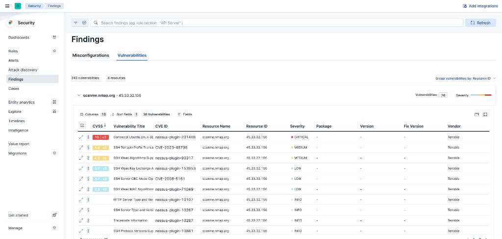

# Nessus ELK Integration

Elastic Agent integration package for [Tenable Nessus](https://www.tenable.com/products/nessus) vulnerability scanner.

Collects vulnerability data from Nessus scans and displays it in Kibana's **Security > Findings > Vulnerabilities** tab using the Elastic Common Schema (ECS).



## Features

- Collects scan results from **all** completed/imported Nessus scans via REST API (CEL input)
- **Incremental collection** — tracks `last_modification_date` to skip unchanged scans
- Enriches each vulnerability with plugin details (CVE, CVSS, description, solution)
- Maps data to ECS for native Kibana Security integration
- Severity levels: CRITICAL, HIGH, MEDIUM, LOW, INFO
- Latest Transform for deduplication and real-time vulnerability state
- Kibana dashboard with trend chart, severity breakdown, and Critical/High metrics
- Supports SSL/TLS, custom CA certificates, and HTTP proxy

## Structure

```
nessus/                              # Fleet package (ZIP this directory)
├── manifest.yml
├── changelog.yml
├── docs/README.md
├── img/nessus-logo.svg
├── _dev/build/build.yml
├── kibana/
│   ├── dashboard/
│   └── index_pattern/
├── data_stream/vulnerability/
│   ├── manifest.yml
│   ├── sample_event.json
│   ├── agent/stream/cel.yml.hbs
│   ├── elasticsearch/ingest_pipeline/default.yml
│   └── fields/
└── elasticsearch/transform/

img/kibana-findings.png              # Screenshot
transform_create.json                # Transform definition for post-install
post-install.ps1                     # Post-install script (PowerShell)
post-install.sh                      # Post-install script (Bash)
docker-compose.yml                   # Dev environment
```

## Quick Start

1. Start the dev environment: `docker compose up -d`
2. Build the package ZIP:

   Fleet requires the ZIP to contain a top-level directory named `{name}-{version}` (e.g. `nessus-1.4.0`). The source directory `nessus/` must be copied with the correct name before archiving:

   **PowerShell:**
   ```powershell
   $v = (Select-String -Path nessus/manifest.yml -Pattern '^version:\s*(.+)$').Matches.Groups[1].Value
   Copy-Item -Recurse nessus "nessus-$v"
   Compress-Archive -Path "nessus-$v" -DestinationPath nessus.zip -Force
   Remove-Item -Recurse -Force "nessus-$v"
   ```

   **Bash:**
   ```bash
   v=$(grep '^version:' nessus/manifest.yml | awk '{print $2}')
   cp -r nessus "nessus-$v"
   zip -r nessus.zip "nessus-$v"
   rm -rf "nessus-$v"
   ```

3. Upload to Fleet:
   ```bash
   curl -sk -u elastic:changeme -X POST "https://localhost:5601/api/fleet/epm/packages" \
     -H "kbn-xsrf: true" -H "Content-Type: application/zip" \
     --data-binary @nessus.zip
   ```
4. Add integration to an agent policy with Nessus API credentials
5. Run the post-install script (see below)

## Post-Install Script

After uploading the package, run the post-install script. It recreates the Latest Transform with proper permissions and clears the "Deferred installations" warning in Fleet.

Fleet creates the transform as the `kibana_system` user, which lacks the required index privileges. The "Reauthorize" button does not work for custom (ZIP-uploaded) packages.

**PowerShell:**
```powershell
.\post-install.ps1
.\post-install.ps1 -Es https://es:9200 -Kbn https://kbn:5601 -Auth elastic:changeme
```

**Bash:**
```bash
chmod +x post-install.sh
./post-install.sh
./post-install.sh https://es:9200 https://kbn:5601 elastic:changeme
```

Defaults: `https://localhost:9200`, `https://localhost:5601`, `elastic:changeme`.

## Requirements

- Elastic Stack 8.13+
- Tenable Nessus with API access enabled
- Docker (for development environment)
- `jq` (for Bash post-install script, optional)
